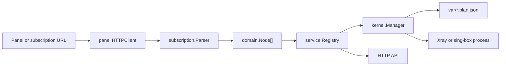

# NodeBridge Architecture

## Design Goal

NodeBridge is a control plane. It should import panel or subscription data, normalize it, enforce local policy, and then hand a deterministic config to a real proxy kernel.

It should not reimplement Xray or sing-box packet handling.

## Module Responsibilities

| Module | Responsibility |
| --- | --- |
| `cmd/nodebridged` | Starts config, sync loop, API server, and kernel manager. |
| `internal/config` | Reads the JSON config and keeps defaults compatible with server deployment. |
| `internal/domain` | Defines the normalized `Node` model shared by panels, subscriptions, renderers, and APIs. |
| `internal/subscription` | Parses V2Board-style base64 subscription bodies and share links into normalized nodes. |
| `internal/panel` | Fetches panel subscription data today; later it should add first-class V2Board API methods. |
| `internal/service` | Owns runtime state, authenticated HTTP endpoints, and scheduled synchronization. |
| `internal/kernel` | Writes generated plans and supervises external core processes. |

## Data Flow

## Config Shape

The layout borrows the useful parts of V2bX-style configuration:

- `kernels`: one or more external cores, such as `sing-box` or `xray`.
- `panels`: one or more panel or subscription sources.
- `runtime`: local sync interval, timeout, and generated file directory.
- `server`: local API listener and bearer token.

This keeps multi-panel and multi-core support from day one.

## Extension Points

- Panel adapters should implement the `panel.Client` behavior or grow behind a richer panel interface.
- Kernel renderers should accept `[]domain.Node` and output valid native config for a specific kernel.
- Local policy modules can sit between `Registry` and `Kernel`, for speed limits, node filters, audit rules, cert settings, and per-node overrides.

